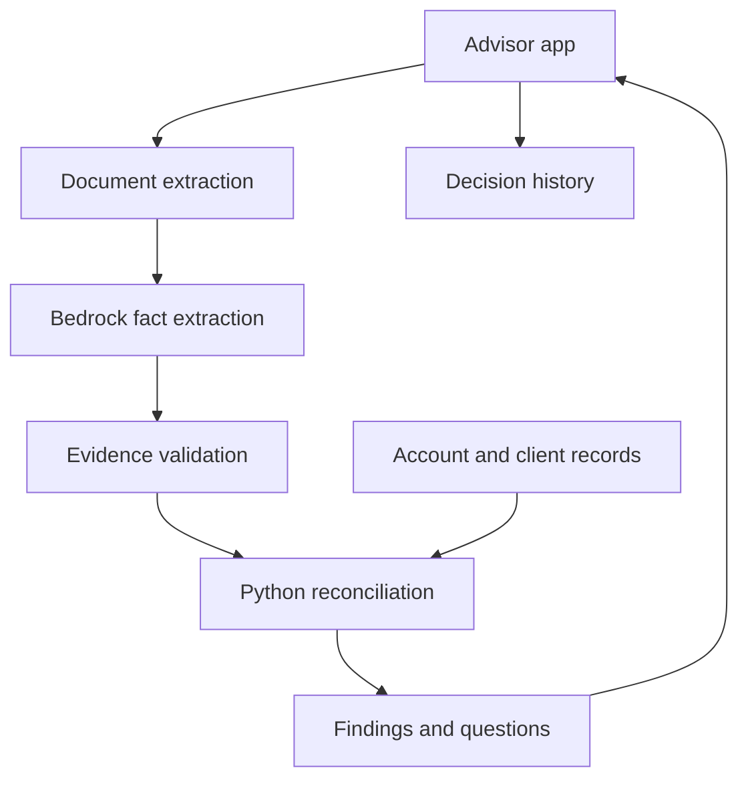

# ClearLegacy Project Guide

## Product vision

ClearLegacy helps financial advisors identify potential inconsistencies between a client's estate-planning documents, stated intentions, and supplied account records. It presents source evidence and organizes follow-up for the advisor and appropriate estate professionals.

**Core promise:** Help an advisor see where documents and account records may need coordination, before a family has to rely on them.

This prototype uses fictional records. It flags questions for review; it does not determine legal validity, inheritance entitlement, probate outcomes, or whether a client's full estate plan is complete.

## Customer and business case

- **User:** A financial advisor reviewing a household with the client.
- **Potential buyer:** A broker-dealer or advisory firm seeking a repeatable review workflow.
- **Initial task:** Compare supplied beneficiary information, account registration, named fiduciaries, and document dates against documented intentions and client profile information.
- **Proposed value:** Reduce comparison effort, make evidence easier to inspect, and turn findings into follow-up tasks.
- **Standalone business hypothesis:** Subscription per advisory practice or advisor, with account-system integrations.
- **Acquisition hypothesis:** LPL could own specialized reconciliation technology, connectors, and the team that maintains the workflow across its advisor network.

A generic model prompt is not a defensible acquisition case. Differentiation would need to come from reliable extraction, explicit comparison logic, useful integrations, evaluated performance, and workflow adoption.

The team notes mention LPL's relationship with Wealth.com. Verify the relationship and current product capabilities before using them in the pitch. Treat ClearLegacy's complementarity as a hypothesis: document-to-account reconciliation and actionable follow-up. Do not claim competitors cannot access account data or lack a capability without evidence.

## Scope and build priorities

### Required working demo

- Select a fictional household and display its supplied account records.
- Upload DOCX and selectable-text PDF files.
- Extract text with source locations, including DOCX table rows.
- Use an available Amazon Bedrock model to extract structured facts.
- Validate source evidence before comparing facts.
- Run explicit Python comparison rules.
- Display findings with document and account evidence.
- Save a review decision and note; display decision history.
- Return a clear no-discrepancy result for a consistent case and clarification questions for incomplete information.

### Add after the core flow works

- Scanned-PDF OCR with Textract.
- S3 document persistence and DynamoDB storage.
- A printable family-meeting agenda.
- Lambda, API Gateway, and Step Functions.

### Outside this hackathon version

- Live LPL account integration or real client records.
- Legal conclusions or automated account/beneficiary changes.
- Automatic attorney outreach.
- Complete estate, tax, or jurisdictional analysis.
- Production authentication, regulatory retention certification, or production-scale claims.

## Architecture decision

**Baseline: Python and Streamlit**, consistent with the starter app already created. The appended React/serverless layout in the team notes is an alternative, not an additional implementation requirement. If the team chooses React, agree on the API contract and revised ownership before starting a second frontend.

AI extracts facts and explains evidence-backed findings. Python rules compare validated facts with supplied account/profile data. The advisor makes the review decision.



### AWS services

| Service | Purpose | Priority |
| --- | --- | --- |
| Bedrock | Structured fact extraction and plain-language explanation | Required |
| Textract | OCR for scanned PDFs | After text PDF and DOCX support |
| S3 | Private document storage | After core analysis |
| DynamoDB | Client, account, finding, and decision persistence | After core analysis |
| Lambda and API Gateway | Hosted analysis API | Optional |
| Step Functions | Orchestrated asynchronous workflow | Optional |

Confirm the event account, allowed region, actual model ID or inference profile, permissions, and credential expiry. The teammate notes name Claude Sonnet 5 and us-east-1; these are event-specific candidates, not verified setup facts. Use the model actually available in the workshop account. Do not guess model IDs.

## Repository layout and ownership

```text
ClearLegacy/
  app.py
  core/
    __init__.py
    schemas.py
    document_reader.py
    extract.py
    explain.py
    validation.py
    rules.py
    pipeline.py
    store.py
  prompts/
    extraction.txt
    explanation.txt
  data/
    clients.json
    documents/
  sample_data/
    01_morgan_discrepancies/
    02_patel_consistent/
    03_rivera_ambiguous/
  evaluation/
  tests/
  docs/
    PROJECT_GUIDE.md
  requirements.txt
  README.md
  .gitignore
```

Keep the existing sample_data/ fixtures. The proposed Johnson story is an additional scenario; do not delete or silently rename shared fixtures. Agree on the presentation household in the team chat.

| Role | Owns | First deliverable |
| --- | --- | --- |
| 1 AI and document intelligence | core/extract.py, core/explain.py, prompts/ | A Bedrock call returning validated-schema facts |
| 2 Rules data and evaluation | core/rules.py, core/validation.py, data/, evaluation/, tests/ | Fictional accounts and rules working on handwritten facts |
| 3 AWS and integration | core/document_reader.py, core/store.py, core/pipeline.py | Working extraction and one integrated analysis call |
| 4 Interface and demo | app.py | Upload and findings screens using clearly labeled sample results |
| 5 Product pitch and submission | docs/, presentation, README coordination | Pitch outline, checkpoints, submission checklist |

Role 3 owns document_reader.py; Role 1 consumes its output. Role 2 owns validation.py; Role 1 specifies the extraction fields with Role 2. Agree on schemas.py together and nominate one editor before changes. Role 5 can also evaluate workflow usability and help prepare fixtures if coding capacity is available.

## Shared function contracts

```python
# core/document_reader.py
read_document(file_bytes, filename) -> dict

# core/extract.py
extract_facts(document) -> dict

# core/validation.py
validate_facts(facts, document) -> dict

# core/rules.py
reconcile(facts_list, client, accounts) -> dict

# core/explain.py
explain(finding) -> dict

# core/pipeline.py
analyze(client_id, documents) -> dict

# core/store.py
get_clients() -> list
get_client(client_id) -> dict
get_accounts(client_id) -> list
save_findings(client_id, analysis_id, findings) -> None
log_decision(client_id, analysis_id, finding_id, decision, user, note) -> None
get_audit(client_id) -> list
```

Store filenames and stable source IDs. PDF locations use page numbers; DOCX locations use paragraph or table-row identifiers, not invented page numbers.

### Document shape

```json
{
  "sourceId": "johnson-will-2019",
  "filename": "johnson_will.pdf",
  "docType": "will",
  "sections": [{"location": "page 1", "text": "Extracted text"}]
}
```

### Extracted facts shape

```json
{
  "sourceId": "johnson-will-2019",
  "docType": "will",
  "facts": [
    {
      "field": "executor",
      "value": "Thomas Johnson",
      "location": "page 1",
      "quote": "I appoint Thomas Johnson as executor."
    }
  ],
  "warnings": []
}
```

Every comparison-relevant fact needs a field, value, source location, and exact supporting quote. Preserve dates, account references, beneficiary tier, and allocation when supplied. Missing information stays unknown. Do not infer an account-specific instruction from a general residuary clause.

### Analysis shape

```json
{
  "analysisId": "generated-unique-id",
  "status": "review_needed",
  "findings": [
    {
      "findingId": "F1",
      "priority": "high",
      "title": "Potential beneficiary coordination gap",
      "explanation": "The supplied records name different recipients. Confirm whether this difference is intentional.",
      "evidence": [
        {
          "sourceType": "document",
          "sourceId": "johnson-will-2019",
          "location": "page 1",
          "quote": "Exact source text"
        },
        {
          "sourceType": "account",
          "sourceId": "DEMO-JOHNSON-4471",
          "field": "todBeneficiaries",
          "value": "Linda Johnson 100%"
        }
      ],
      "recommendedAction": "Confirm intentions with the client and flag for appropriate professional review.",
      "decision": null
    }
  ],
  "clarificationQuestions": [],
  "warnings": []
}
```

Allowed priorities: high, review. These are review priorities, not legal certainty or probabilities. Allowed analysis statuses: review_needed, no_discrepancies_found, needs_information, failed. Only claim no discrepancies after extraction and validation complete successfully within the supplied scope.

## Comparison rules

| Condition | Output | Limit |
| --- | --- | --- |
| Explicit account-specific intended beneficiary differs from account designation | Potential beneficiary mismatch | Ask whether the difference is intentional |
| General will recipients differ from account TOD recipients | Coordination question | The instruments can intentionally cover different assets |
| Document explicitly identifies an account intended for trust ownership, but supplied registration is individual | Potential registration gap | Do not conclude the entire trust is unfunded or predict probate |
| Named fiduciary/contact is identified as deceased in supplied profile | Role or contact update question | Check alternate appointments; do not conclude nobody can act |
| Document governing state differs from current residence | Professional review question | A move alone does not prove invalidity or a tax problem |
| Snapshot is old or information absent | Request current records | Missing data is not evidence of a missing designation |

Compare allocations separately by account and primary/contingent tier. Different beneficiaries across accounts are not inherently inconsistent.

Quote validation reduces unsupported outputs; it does not prove legal correctness. Verify that each finding actually follows from its evidence. Unsupported facts are excluded and surfaced as warnings. Treat uploaded text as data, never as instructions to the model.

## Demo households

### Existing fixtures

| Household | Expected behavior |
| --- | --- |
| Morgan | Two findings supported by explicit account-specific intentions |
| Patel | No discrepancies within the supplied scope |
| Rivera | Clarification questions about stale records and unspecified intentions |

### Proposed Johnson presentation scenario

Robert Johnson is a fictional 74-year-old client living in Virginia, with current spouse Carol, former spouse Linda, and children Emily, David, and Sarah. Supplied documents include a 2019 will, a 2021 trust summary, and a 2014 power-of-attorney summary. The profile records Thomas Johnson's death in March 2025.

| Fictional account | Registration | Supplied designation | Fictional value |
| --- | --- | --- | --- |
| DEMO-JOHNSON-4471 | Individual Robert Johnson | Linda Johnson TOD 100%, recorded 2009 | $1.2M |
| DEMO-JOHNSON-8820 | IRA | Carol Johnson primary 100% | $640K |
| DEMO-JOHNSON-3302 | Joint with Carol | No designation supplied | $85K |

Use short fictional summaries rather than presenting generated documents as legally valid executed instruments. Add a dated statement of intentions that specifically references account 4471 if the demo needs a supported beneficiary mismatch. Identify the account explicitly in the trust summary for a registration comparison. Include alternates or mark them unknown for deceased-role review.

Keep scanned copies labeled and separate; do not upload the same source twice as independent evidence. The earlier generated PDFs contain selectable text and do not exercise OCR.

## Advisor experience

1. Choose household; show supplied records and their snapshot dates.
2. Upload planning documents and account evidence separately.
3. Preview extracted text and missing-information warnings.
4. Analyze; show real pipeline progress.
5. Inspect findings with evidence side by side.
6. Confirm review finding, dismiss with reason, or flag for attorney review.
7. Display saved decisions and follow-up questions.

Flagging for attorney review creates an internal task only. It does not send anything externally. Confirming a finding records a review decision; it does not change an account.

Use session state for UI continuity and the store module for persistence. Clearly distinguish not analyzed, processing, review needed, and reviewed. Use a stable analysis ID so findings and decisions do not collide across reruns.

A saved-results mode can back up the live demo, but it must be visibly labeled. Do not present prerecorded or cached results as a successful live AWS analysis.

## Evaluation and pitch evidence

- Count planted discrepancies detected and unsupported findings by case.
- Evaluate clean and ambiguous records, not just the positive case.
- Check quote grounding, account matching, primary/contingent handling, and dates.
- Record end-to-end runtime and review time on the actual sample workflow.
- Test blank files, extraction failures, malformed model output, and expired AWS access.
- Keep answer keys out of the model input.

Zero false alarms on two controls is a demo result, not production accuracy. Never fabricate test results, costs, scale, prevented losses, or retained assets.

For projected ROI, show inputs separately: reviews per year x measured or assumed time saved x labor cost. Describe retention benefits as hypotheses; do not assume every heir meeting retains assets or attribute total account value to ClearLegacy revenue.

Claims in the teammate notes about Cerulli transfers, heir retention, competitor capabilities, review hours, and per-analysis cost need primary/source verification before publication. Keep unverified figures out of slides.

## Security and failure handling

- Fictional data only; no credentials in the repository.
- Keep .venv/, .env, .aws/, .streamlit/secrets.toml, and local uploads ignored.
- Apply access restrictions and private storage when adding cloud persistence.
- Avoid raw document content in diagnostic logs; do not promise masking unless implemented and checked.
- Use model and AWS configuration outside code; preserve temporary credential handling.
- If extraction is empty, request OCR or a readable file.
- If analysis fails, show failed status with a useful message, not a clean result.
- Production security, retention, authorization, and legal controls remain future work.

## Git collaboration

One branch per owner. Use pull requests and a short review before merging. Avoid shared-file edits without coordination.

```powershell
git switch main
git pull origin main
git switch -c feature/your-area
```

For an existing feature branch, commit or safely stash work first, fetch main, then merge main into that branch. Do not create a fresh branch for every coding session.

Nominate Role 4 as app.py owner and Role 3 as requirements.txt owner. Send dependency additions to that owner. Update README setup steps when dependencies or AWS configuration change.

Before signing off, post: what works, what fails, what is next, and which branch/PR contains it.

## Checkpoints and submission

The team notes propose these internal targets. Organizer requirements take priority.

| Milestone | Eastern time | Colorado Mountain time |
| --- | --- | --- |
| AWS connection, schemas, and initial stubs ready Friday | 2 PM | Noon |
| Category-selection form arrives Friday | 3 PM | 1 PM |
| One document extraction and initial rules/UI ready Friday | 5 PM | 3 PM |
| Complete demo Friday | 9 PM | 7 PM |
| Code freeze Saturday | 9 AM | 7 AM |
| Backup recording and rehearsals Saturday | 10:30 AM | 8:30 AM |
| Internal submission target Saturday | 11:30 AM | 9:30 AM |
| Official submission deadline Saturday October 3 | Noon | 10 AM |
| Judging window Saturday | 12:30 to 2 PM | 10:30 AM to noon |

Choose two main award categories. Proposed targets: Startup We'd Buy Tomorrow and Biggest Business Impact. Best Use of AWS is automatic. The category form arrival time is not a verified deadline to complete the form; check its instructions.

Required: LPL-template deck, working prototype/demo, code ZIP, completed submission form, and upload to assigned Box folder. Presentation: five minutes plus five minutes of questions. Confirm the actual assigned judging time.

## Five minute presentation

- **30 seconds:** Fictional household and concrete coordination problem; avoid asserting who legally inherits.
- **30 seconds:** User workflow and business need.
- **2 minutes:** Live upload, analysis, evidence, and saved review decision.
- **40 seconds:** AI extraction, validation, Python comparison, AWS services actually used.
- **50 seconds:** Standalone business, acquisition hypothesis, differentiation, measured results and labeled projections.
- **10 seconds:** Team and next milestone.

