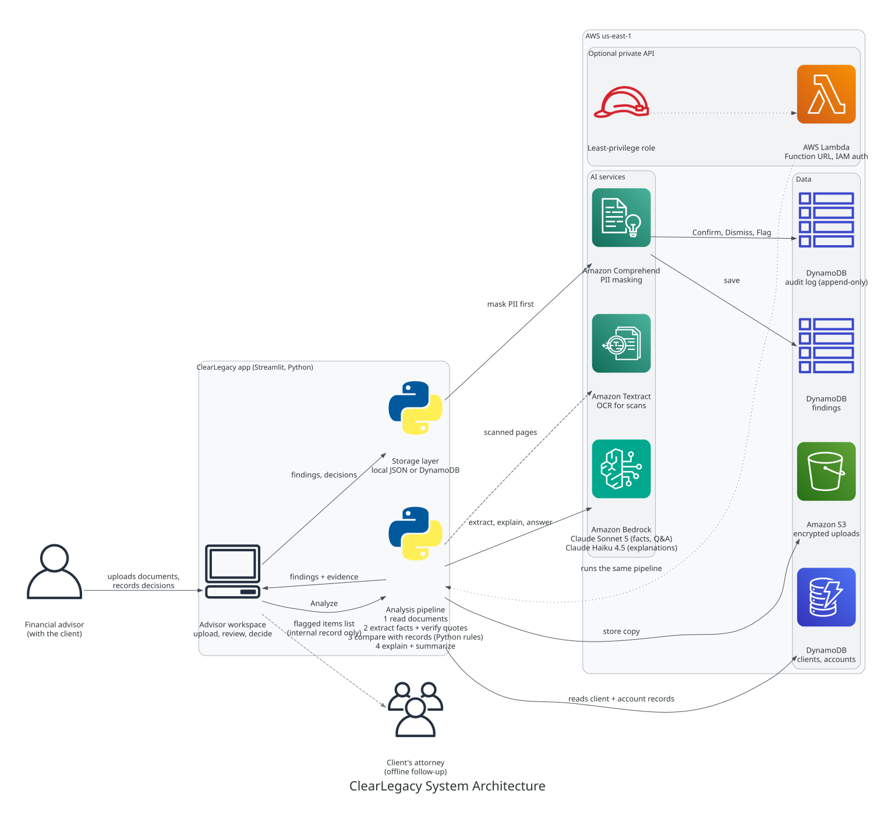

# ClearLegacy

**Helping advisors spot gaps between estate planning intentions and account records.**

ClearLegacy helps financial advisors review a client’s estate planning documents alongside the firm's account records. It highlights potential inconsistencies, shows the supporting evidence, and helps advisors track what needs follow-up.


## Why ClearLegacy?

Estate planning documents and account records can fall out of sync as families and circumstances change. A client may intend to leave an IRA to their current spouse while the account still names a former spouse. A trust may describe an account that remains registered individually.

ClearLegacy helps advisors identify these differences and prepare informed conversations with clients and their attorneys.

## Features

- **Review estate documents against the accounts on file:** Upload a client's will, trust, POA, or planning summary; ClearLegacy compares them with the firm's account records for that household.
- **Spot potential inconsistencies:** Identify beneficiary mismatches, accounts not titled to the trust, deceased fiduciaries, governing-state differences, and missing beneficiaries.
- **See supporting evidence:** Each finding shows the highlighted document excerpt next to the account record it conflicts with.
- **Wrong-client safety check:** If a document names a different client, or an account on file for another household, the analysis stops before any comparison and nothing is saved to the household.
- **Track review decisions:** Confirm, dismiss (with a reason), or flag findings for attorney review. The reviewer's name is recorded with every decision in an append-only review history.
- **Next steps and printable summaries:** Decisions are organized into a client follow-up list, an attorney review list, documented dismissals, and items still to review, with downloadable summaries for each meeting.
- **Identify missing information:** Get clarifying questions when the documents do not provide enough detail.
- **Ask follow-up questions:** Explore the supplied documents through answers linked to their sources.

## How it works



1. **Upload.** The advisor picks the client household and uploads the client's estate documents (will, trust, power of attorney, planning summary). The household's accounts and beneficiaries come from the firm's account records on file (`data/clients.json`, or DynamoDB in AWS mode), not from uploads. With S3 turned on, each upload is stored as an encrypted copy. Scanned pages are read with Amazon Textract.
2. **Extract.** When the advisor clicks **Analyze**, the pipeline sends the document text to Amazon Bedrock. Claude Sonnet 5 extracts the facts that matter (beneficiaries, executors, trust accounts, governing state, the client's name), each with its exact quote and page. Any fact whose quote can't be found in the document is discarded, so the AI can't invent evidence.
3. **Check the client.** Before any comparison, ClearLegacy checks that each document belongs to the selected household. If a document names a different client, or refers to an account on file for another household, the analysis stops with "Stopped: client mismatch": no findings, no questions, nothing saved for the household, and the S3 copy is removed. One event is recorded in the review history.
4. **Compare.** Deterministic Python rules compare the facts with the accounts on file. They flag mismatches such as a TOD beneficiary who isn't in the will, an account the trust says it holds that's still in the client's own name, a deceased POA agent, or a will governed by another state's law. When information is missing, they ask clarifying questions instead of guessing.
5. **Review.** Claude Haiku 4.5 explains each finding in plain English, and every finding shows the evidence side by side. The advisor enters their name once, then chooses **Confirm**, **Dismiss** (with a reason), or **Flag for attorney** for each finding, and can ask follow-up questions that get answers with cited sources.
6. **Record.** With PII masking on, findings and decision notes pass through Amazon Comprehend, which masks SSNs, account and card numbers, phone numbers and emails before they are stored. Decisions are saved to an append-only audit log (DynamoDB in AWS mode) that can't be altered afterwards.
7. **Follow up.** The **Next steps** tab lists confirmed items and clarifying questions for the client, flagged items for the client's attorney, and documented dismissals, with printable summaries for each. ClearLegacy never contacts anyone, changes an account, or gives legal advice; the advisor stays in control.

The same pipeline can also be deployed as a private API on AWS Lambda (IAM-authenticated, least-privilege role) so it can plug into other advisor systems later.

> ClearLegacy supports advisor and attorney review. It does not provide legal advice.

## Running ClearLegacy

Open a terminal (PowerShell on Windows) in the ClearLegacy repository folder and
get the latest code:

```powershell
git checkout main
git pull origin main
```

macOS/Linux users: activate with `source .venv/bin/activate`, and set variables
with `export NAME="value"` instead of `$env:NAME="value"`. You can also paste the
credentials block for your OS straight from the workshop page.

### 1. Activate your virtual environment

```powershell
.\.venv\Scripts\Activate.ps1
```

If you have not created the environment yet, follow the Python environment
setup section first.

### 2. Install dependencies

Run this on your first setup or whenever `requirements.txt` changes:

```powershell
python -m pip install -r requirements.txt
```

### 3. Set your workshop AWS credentials

Copy the three values from the workshop page into the **same terminal** you will
start the app from. They expire, so repeat this step when you get fresh ones.

```powershell
$env:AWS_ACCESS_KEY_ID="..."
$env:AWS_SECRET_ACCESS_KEY="..."
$env:AWS_SESSION_TOKEN="..."
$env:AWS_REGION="us-east-1"
```

On macOS or Linux use `export AWS_ACCESS_KEY_ID="..."` and so on.

### 4. Check your setup

```powershell
python scripts/check_setup.py
```

It checks Python, packages, client records, DOCX reading, AWS credentials, and
access to both Bedrock models, and tells you how to fix anything that fails.

### 5. Start the app

```powershell
python -m streamlit run app.py
```

Streamlit will display a local URL, usually `http://localhost:8501`.
Open that URL in your browser if it does not open automatically.

Keep the terminal running while using the app. To stop it, press **Ctrl+C**.

### Using the app

1. Choose a household in the sidebar (Jordan Morgan, Sam Patel, or Robin Rivera).
   Its accounts on file are shown straight away; they come from the firm's
   records, not from uploads.
2. Upload that household's estate documents from `sample_data/` (PDF or DOCX;
   upload one format of each document, not both, or questions will repeat).
3. Click **Analyze**. The AI runs only when you click, and the result is kept for
   the session (about 30 seconds per household; the steps show live).
4. Enter your name in **Reviewer** (required). For each finding, compare the
   highlighted document excerpt with the account record, then **Confirm**,
   **Dismiss** (a short reason is required), or **Flag for attorney**.
5. Open **Next steps** for the client follow-up list, the attorney list, and
   documented dismissals, and download the printable summaries.
6. Use the **Ask ClearLegacy** tab for follow-up questions (try a starter
   question). Answers cite their sources and are read-only.

Expected results:

| Household | Upload | Expected result |
|---|---|---|
| Jordan Morgan | `01_morgan_discrepancies/planning_summary.pdf` | 2 findings: IRA primary beneficiary mismatch, and missing contingent beneficiaries |
| Jordan Morgan (estate) | `04_morgan_estate`: will, trust, and POA summaries | 4 findings (1 critical, 2 high, 1 review): brokerage TOD differs from the will, brokerage not titled to the trust, deceased POA agent (Pat Morgan), and will governed by FL while the client lives in GA |
| Sam Patel | `02_patel_consistent/planning_summary.pdf` | No discrepancies |
| Robin Rivera | `03_rivera_ambiguous/planning_summary.pdf` | Needs more information (clarifying questions) |
| Jordan Morgan (wrong client) | `02_patel_consistent/planning_summary.pdf` | Stopped: client mismatch (no findings; one review-history event) |

The `account_records` files in `sample_data/` are printouts of the records on
file. They are not needed for analysis.

To show OCR, upload `tests/fixtures/scanned/morgan_planning_summary_scanned.pdf`
(an image-only scan) as Morgan's planning summary. The results are the same.

If analysis fails, the app shows why: missing or expired credentials, or a
model that isn't enabled (set `CLEARLEGACY_MODEL_ID` to change it).

## Run with AWS services

The steps above run in **local mode**: Bedrock for AI, local JSON files for
storage. That is the default and needs nothing else. To turn on the other AWS
services, do this once per AWS account:

```bash
python infra/setup_aws.py      # encrypted private S3 bucket + 4 on-demand DynamoDB tables (safe to rerun)
python infra/seed_dynamodb.py  # load data/clients.json into DynamoDB
```

Then set the flags (in the same terminal as your credentials) and start the app:

```powershell
$env:CLEARLEGACY_STORAGE="dynamodb"
$env:CLEARLEGACY_USE_S3="1"
$env:CLEARLEGACY_USE_TEXTRACT="1"
$env:CLEARLEGACY_PII_MASKING="1"
$env:CLEARLEGACY_BUCKET="clearlegacy-<account-id>-us-east-1"   # printed by setup_aws.py
python scripts/check_setup.py
python -m streamlit run app.py
```

On macOS or Linux use `export NAME="value"`. Turn on **Show system details** in
the sidebar to see which backends are active and where decisions are saved; the
sidebar shows "Personal information protected" when PII masking is on.

**Each workshop AWS account needs its own resources.** The bucket, tables, and
Lambda are created inside whichever account your credentials belong to. If
`check_setup.py` says the bucket or tables are missing, run the two `infra/`
commands above once in your account. Local mode works in any account.

**Any AWS error falls back to local behavior with a visible warning; it never
crashes.** That covers expired credentials, a missing table or bucket, and a
denied call.

### Feature flags

| Variable | Values (default first) | Effect |
|---|---|---|
| `CLEARLEGACY_STORAGE` | `json` / `dynamodb` | Where clients, accounts, findings, decisions and the audit log are stored. DynamoDB uses the same functions and return shapes as JSON, and the audit log is append-only (conditional writes). |
| `CLEARLEGACY_USE_S3` | `0` / `1` | Also store each upload at `s3://<bucket>/clients/<clientId>/<filename>` (SSE-S3). Processing is unchanged. |
| `CLEARLEGACY_USE_TEXTRACT` | `1` / `0` | OCR **only** pages with no text layer. Single pages and images use synchronous Textract; multi-page scans go through S3 with the async API (60-second timeout). Also enables PNG/JPG uploads. |
| `CLEARLEGACY_PII_MASKING` | `0` / `1` | Amazon Comprehend masks SSNs, bank and card numbers, phone numbers and emails in what is **stored or logged** (findings, decision notes, audit log, log messages). It does not mask what the AI reads or what the advisor sees. If Comprehend fails, a local pattern mask is used instead. |
| `CLEARLEGACY_BUCKET` | (none) | S3 bucket for uploads and multi-page OCR |
| `CLEARLEGACY_TABLE_PREFIX` | `clearlegacy-` | DynamoDB table name prefix |

### Optional: analysis API on AWS Lambda

```bash
python infra/deploy_lambda.py    # least-privilege role + function + Function URL (IAM auth)
python infra/invoke_lambda.py morgan sample_data/01_morgan_discrepancies/planning_summary.pdf
```

The URL rejects unsigned requests; `invoke_lambda.py` signs with your
credentials. It uses a Function URL rather than API Gateway because HTTP APIs
time out at 30 seconds and an analysis takes about 25 seconds. Rerun
`deploy_lambda.py` after pipeline changes so the function runs the current code.

### Cost and cleanup

Everything is pay-per-use (on-demand DynamoDB, S3, Textract, Comprehend, Lambda);
nothing runs while idle. Each analysis returns `usage` with Bedrock tokens and an
estimated cost (prices in `core/bedrock_client.py`, marked to verify against AWS
Bedrock pricing).

To remove everything:

```bash
python infra/deploy_lambda.py --teardown
python infra/setup_aws.py --teardown
```

Both ask for confirmation first.

### AWS services actually used

Only services verified live on Oct 2, 2026, in the workshop account (us-east-1):

| Service | What ClearLegacy uses it for | How it was verified |
|---|---|---|
| **Amazon Bedrock** (Claude Sonnet 5, Claude Haiku 4.5) | Fact extraction, explanations, case summary, advisor Q&A (Converse API with tool use) | Morgan, Patel and Rivera all gave the expected results in both modes |
| **Amazon Textract** | OCR for scanned pages (sync for single pages, S3 + async for multi-page) | A scanned Morgan planning summary still gave both expected findings; a 2-page scan was read through the async API with the temporary file deleted |
| **Amazon S3** | Encrypted (SSE-S3), private, versioned storage of uploaded documents | Uploads stored under `clients/<clientId>/` with `ServerSideEncryption: AES256`; public access block and versioning confirmed |
| **Amazon DynamoDB** (on-demand) | Clients, accounts, findings, decisions, append-only audit log | Records identical to the JSON store; an attempt to overwrite an audit entry was refused by DynamoDB |
| **Amazon Comprehend** | PII masking of stored notes, findings and logs | A stored decision note was saved with `[PHONE]`, `[SSN]`, `[EMAIL]` in place of the values; names and account IDs were kept |
| **AWS Lambda** (Function URL, IAM auth) | Runs the full analysis pipeline as a private API | A signed request returned the correct Morgan and Patel results; an unsigned request got HTTP 403. Redeployed Oct 3: Patel's summary sent for Morgan returned `client_mismatch` and its S3 copy was removed |
| **AWS IAM / STS** | Least-privilege Lambda role; temporary workshop credentials | Role created by `deploy_lambda.py`; identity checked by `check_setup.py` |

Not used: API Gateway (30-second limit), Step Functions, and any always-on
services.

## Role 3: AWS and integration

The integration layer is responsible for document reading, JSON runtime storage,
Bedrock extraction wiring, and pipeline integration. The prototype uses
fictional sample data. Optional AWS resources (S3, DynamoDB, Lambda) are created
only when you run the `infra/` scripts; see "Run with AWS services" above.

### macOS/Linux setup

```bash
python3 -m venv .venv
source .venv/bin/activate
python -m pip install -r requirements.txt
```

Configure the workshop AWS credentials in the same terminal used to start the
app. Temporary credentials require all three values:

```bash
export AWS_ACCESS_KEY_ID="..."
export AWS_SECRET_ACCESS_KEY="..."
export AWS_SESSION_TOKEN="..."
export AWS_REGION="us-east-1"
```

Verify the session before starting Streamlit:

```bash
aws sts get-caller-identity --region us-east-1
python -m streamlit run app.py
```

Bedrock extraction is done by `core/extract.py` (Role 1), which uses Claude
Sonnet 5 by default. Override the models with `CLEARLEGACY_MODEL_ID` and
`CLEARLEGACY_FAST_MODEL_ID` (see "Role 1: AI extraction" below). Never commit AWS
credentials, `.env` files, `.aws/`, or Streamlit secrets.

If STS or Bedrock reports an invalid security token, refresh the temporary
workshop credentials and restart Streamlit from the same terminal.

## Project guide

See [the ClearLegacy project guide](PROJECT_GUIDE.md)
for scope, architecture, team responsibilities, and demo expectations.

### Troubleshooting

- **`app.py` not found:** Make sure your terminal is in the repository folder.
- **`No module named streamlit`:** Activate the correct environment and
  install the dependencies.
- **Activation blocked:** Launch using the environment's Python directly:

```powershell
.\.venv\Scripts\python.exe -m streamlit run app.py
```

## Python environment setup

Use a separate virtual environment for ClearLegacy. Each teammate creates
their own local `.venv`; it is excluded from Git.

### Windows PowerShell

From the ClearLegacy repository folder, check your Python version:

```powershell
python --version
```

We are developing with Python 3.12.10.

If another project's virtual environment is active, deactivate it:

```powershell
deactivate
```

Create ClearLegacy's environment once:

```powershell
python -m venv .venv
```

Activate it:

```powershell
.\.venv\Scripts\Activate.ps1
```

Confirm that Python is using the correct environment:

```powershell
python -c "import sys; print(sys.executable)"
```

The path should end in `ClearLegacy\.venv\Scripts\python.exe`.
The `(.venv)` prompt alone does not confirm which project's environment is active.

Install the project dependencies:

```powershell
python -m pip install -r requirements.txt
```

Run the app:

```powershell
python -m streamlit run app.py
```

### Returning to the project

Activate the existing environment and launch the app:

```powershell
.\.venv\Scripts\Activate.ps1
python -m streamlit run app.py
```

You do not need to recreate `.venv` each time.

### Troubleshooting

- If `py` is not recognized, use `python` instead.
- If Python points to another project's `.venv`, deactivate that environment
  and activate ClearLegacy's.
- If activation is blocked, run the environment's Python directly:

```powershell
.\.venv\Scripts\python.exe -m pip install -r requirements.txt
.\.venv\Scripts\python.exe -m streamlit run app.py
```

Never commit `.venv`, AWS credentials, or secret configuration files.
## Role 1: AI extraction

Follows the shared contracts in the project guide. The AI only **extracts facts** and **explains findings**. Comparison is done by Python rules in `core/rules.py` (Role 2). Every fact carries a `location` and a verbatim `quote`, and `core/validation.validate_facts` excludes any fact whose quote isn't in the document (it becomes a warning).

### Functions

| Function | Input | Output |
|---|---|---|
| `core.extract.extract_facts(document)` | document shape from `core/document_reader.read_document` | `{sourceId, docType, facts, warnings}` (not yet validated) |
| `core.validation.validate_facts(facts, document)` | facts + the same document | unsupported facts removed (message in `warnings`, fact in `excludedFacts`), wrong locations corrected |
| `core.explain.explain(finding)` | guide finding (`findingId, priority, title, evidence`) | the same finding plus `explanation` (<=2 sentences) and `recommendedAction` (1 sentence) (Haiku 4.5) |
| `core.explain.find_additional_conflicts(facts_list, client, accounts)` | validated facts, client dict, accounts list | optional extra findings, all `priority: "review"`. Every evidence item must match a validated fact quote or an actual account field value, or the finding is dropped. |
| `core.explain.summarize_case(client, findings)` | client dict, findings (with explanations) | `{"summary": "<=3 sentences"}` (Haiku 4.5). With no findings, returns a fixed "nothing flagged within supplied scope" sentence without calling the model. |
| `core.assistant.answer_question(question, facts_list, client, accounts, findings=None, history=None)` | advisor question, validated facts, client, accounts, optional findings and prior turns `[{"question", "answer"}]` | `{"answer", "canAnswer", "citations": [evidence], "droppedCitations"}`. Read-only, with no tools that change anything. Citations are verified like AI findings, and a factual answer with no verified citation is withheld. |
| `core.extract.load_document(path, doc_type, source_id)` | local `.pdf` or `.txt` (`=== PAGE N ===` separators) | the shared document shape, a stand-in until Role 3's reader is ready (no DOCX yet) |
| `core.extract.extract_document(path, doc_type, source_id)` | local file | load + extract + validate, for scripts |

`warnings` is a list of plain-text messages, matching how `core/rules.py` and the pipeline use it. It covers:
- an empty document (Bedrock is not called)
- malformed model facts, which are skipped
- a missing fact list
- facts whose quote was not found in the document

`validate_facts` also returns the excluded facts themselves in `excludedFacts`.

`explain(finding)` returns the finding with `explanation` and `recommendedAction` added, so the pipeline can replace each finding with the result without losing its ID, title, priority or evidence.

Bedrock failures (timeouts, truncated output, a missing or garbled tool result) raise `core.bedrock_client.BedrockError`, so the pipeline can show a failed status instead of a clean result.

### Fact shape

```json
{"field": "intended_beneficiary", "value": "Casey Morgan", "location": "page 1",
 "quote": "I want Casey Morgan to receive 100% as primary beneficiary of my IRA DEMO-MORGAN-IRA.",
 "accountRef": "DEMO-MORGAN-IRA", "tier": "primary", "allocation": "100%",
 "relationship": "spouse", "asOf": null}
```

The extra keys (`accountRef`, `tier`, `allocation`, `relationship`, `asOf`) are always present and `null` when not stated.

`field` is one of: `document_id`, `document_date`, `snapshot_date`, `governing_state`, `client_name`, `family_member`, `intended_beneficiary` (account-specific intention), `intentional_exclusion`, `residuary_beneficiary` (general will or trust clause, never account-specific), `executor`, `alternate_executor`, `trustee`, `successor_trustee`, `poa_agent`, `successor_poa_agent`, `guardian`, `trust_owned_account`, `account_beneficiary` (designation on record), `account_registration`, `account_owner`, `missing_information`, `unspecified_intention`. Definitions are in `prompts/extraction.txt`.

`docType` is one of: `will`, `trust`, `poa`, `planning_summary`, `account_records`, `beneficiary_form`, `other`.

### Prompts

`prompts/extraction.txt`, `explanation.txt`, `conflicts.txt`, `summary.txt` and `assistant.txt` are loaded at import. Document text is treated as data, never as instructions.

### Configuration and limits

- AWS credentials come from environment variables only. Region comes from `BEDROCK_REGION`, `AWS_REGION` or `AWS_DEFAULT_REGION` (default `us-east-1`). Never commit credentials.
- `CLEARLEGACY_MODEL_ID` (default `us.anthropic.claude-sonnet-5`) and `CLEARLEGACY_FAST_MODEL_ID` (default `us.anthropic.claude-haiku-4-5-20251001-v1:0`).
- Expired credentials raise `AWSCredentialsExpired` ("AWS credentials expired: refresh them from the workshop page"). Missing credentials raise its subclass `AWSCredentialsMissing`, which says which variables to set. A model the account can't use gives a `BedrockError` that names `CLEARLEGACY_MODEL_ID`.
- Cost per call: one Bedrock call per document extraction, one per `explain`, one for `find_additional_conflicts`, one for `summarize_case`, and one per `answer_question`. Each document takes about 6–11 seconds and a few thousand tokens.
- Workshop quotas are far above this (Sonnet 5: 6M tokens per minute; Haiku 4.5: 10,000 requests per minute; Textract: 25 per second).
- The client retries throttled calls with adaptive backoff (up to 5 attempts).
- In Streamlit, only call Bedrock on a button press and keep results in `st.session_state`, so reruns don't repeat calls.

### Running

```bash
pip install -r requirements.txt
python -m pytest tests                  # validation and evidence tests, no AWS needed
python scripts/make_fixture_pdfs.py     # regenerate tests/fixtures/pdf/ from the .txt fixtures
python scripts/run_role1_demo.py        # live demo: extraction, explanation, AI findings, case summary, Q&A (~17 Bedrock calls, ~2 min)
```

All fixtures are fictional demonstration summaries, not legal documents.
